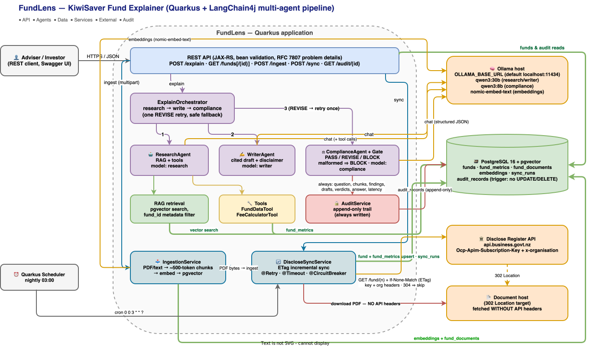
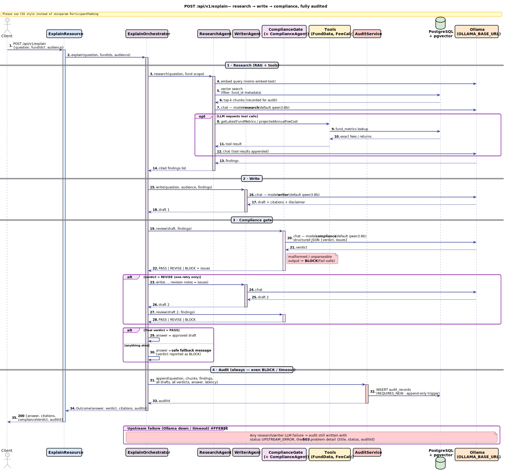
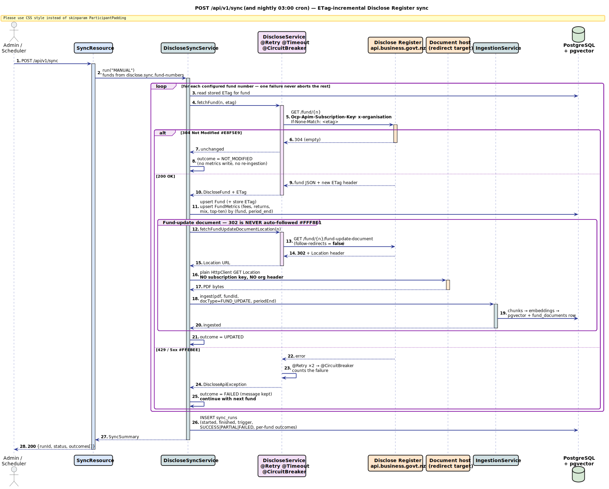
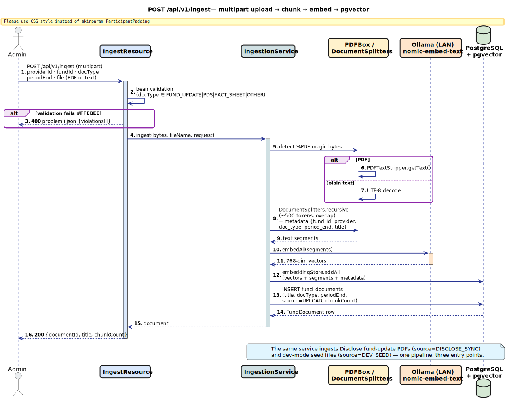
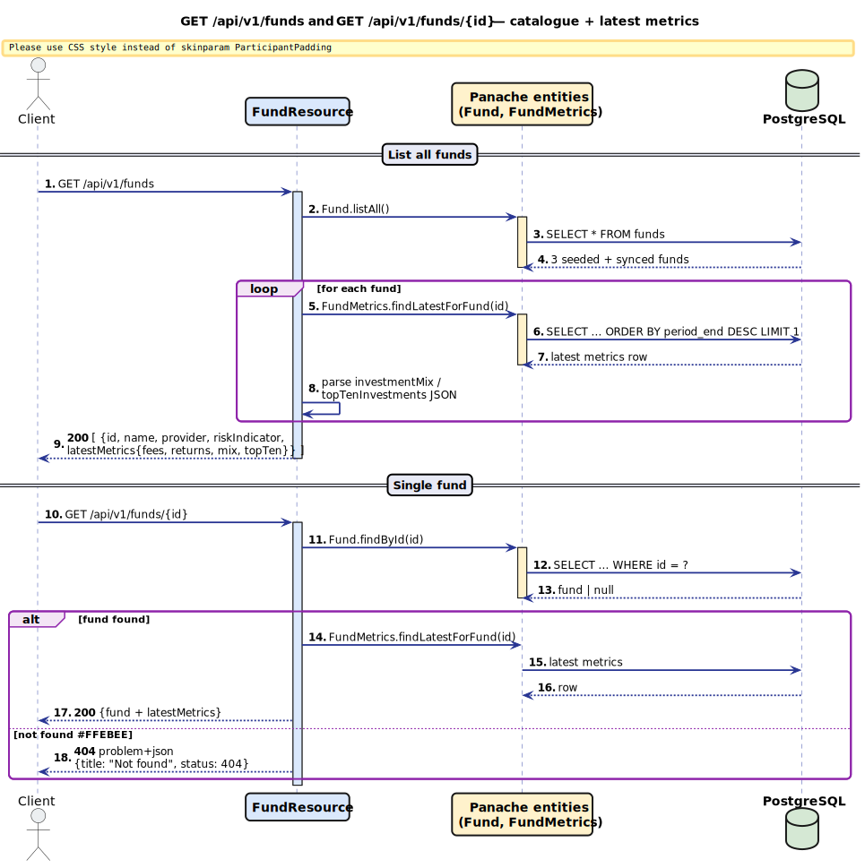
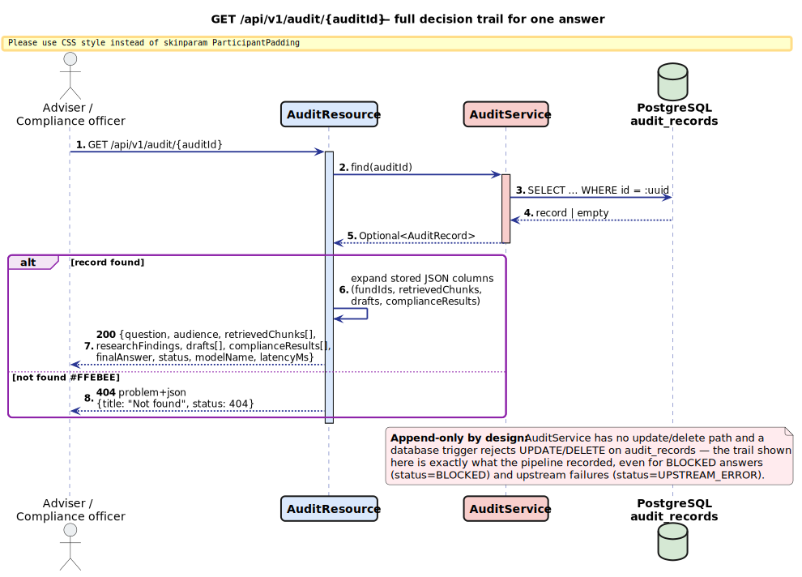

# FundLens — KiwiSaver Fund Explainer API

A Quarkus API where financial advisers (or investors) ask natural-language questions about
KiwiSaver funds and receive **cited, compliance-checked explanations** grounded in public
regulatory data from the NZ Disclose Register. The differentiator is the **audit trail and
compliance gate**: every answer records which documents were retrieved, what each agent
decided, and why the compliance agent passed or blocked the response.

## Architecture



*Editable source: [`docs/architecture.drawio`](docs/architecture.drawio) — re-export with
`draw.io -x -f svg --embed-svg-images -o docs/architecture.svg docs/architecture.drawio`.*

All three agents are quarkus-langchain4j declarative AI services on the Ollama provider,
each with its **own named model configuration** (`research`, `writer`, `compliance`) so the
compliance gate can later run a different model than the writer.

### Sequence diagrams

One per endpoint, sources in [`docs/sequence/`](docs/sequence/) (PlantUML) with
pre-rendered SVGs in `docs/sequence/rendered/`. Re-render with
`plantuml -tsvg -o rendered docs/sequence/*.puml` (`brew install plantuml`) or the
IntelliJ/VS Code PlantUML plugin.

Colour key (all diagrams): blue = REST API, purple = agents/orchestration, green = data
(Postgres/pgvector), cyan = ingestion/sync services, orange = external systems (Ollama,
Disclose Register), red = audit/fail-safe paths.

#### `POST /api/v1/explain` — the agent pipeline



<details>
<summary><b><code>POST /api/v1/sync</code></b> — ETag-incremental Disclose Register sync</summary>


</details>

<details>
<summary><b><code>POST /api/v1/ingest</code></b> — upload → chunk → embed → pgvector</summary>


</details>

<details>
<summary><b><code>GET /api/v1/funds[/{id}]</code></b> — catalogue + latest metrics</summary>


</details>

<details>
<summary><b><code>GET /api/v1/audit/{auditId}</code></b> — decision trail retrieval</summary>


</details>

## Prerequisites

- Java 21+, Docker (for Postgres and Testcontainers)
- **An Ollama server** with the models pulled:
  `ollama pull qwen3:30b && ollama pull qwen3:8b && ollama pull nomic-embed-text`.
  FundLens defaults to `http://localhost:11434`. If Ollama runs on a **different
  machine** (a LAN GPU box, a server), point `OLLAMA_BASE_URL` at it — the easiest
  way is a local `.env` file (gitignored, picked up by every `make` target):

  ```bash
  # .env
  OLLAMA_BASE_URL=http://<ollama-host-ip>:11434
  ```

  A remote Ollama must bind all interfaces, not just loopback:
  - macOS: `launchctl setenv OLLAMA_HOST 0.0.0.0`, then restart Ollama
  - Linux: systemd override — `systemctl edit ollama`, add
    `[Service]` / `Environment="OLLAMA_HOST=0.0.0.0"`, then `systemctl restart ollama`
  - Verify from this machine: `curl http://<ollama-host-ip>:11434/api/tags`
- **Disclose Register API access** (only needed for `POST /api/v1/sync`):
  1. Register at [portal.api.business.govt.nz](https://portal.api.business.govt.nz) and
     subscribe to the **Disclose (Sandbox)** product first; the subscription key appears
     under "My applications" once approved.
  2. Complete the Disclose Register organisation setup to get your organisation ID.
  3. Export both: `DISCLOSE_SUBSCRIPTION_KEY=...` and `DISCLOSE_ORGANISATION_ID=...`.
     Point `DISCLOSE_BASE_URL` at the sandbox endpoint until you're approved for production.

## Quickstart

```bash
make up        # start Postgres, then
make dev       # open http://localhost:8080
```

### Makefile targets

| Target | What it does |
|---|---|
| `make up` | Starts Postgres (`pgvector/pgvector:pg16`) via docker-compose on `localhost:5433`, waits until healthy |
| `make dev` | `make up` + `./mvnw quarkus:dev` on `http://localhost:8080` — live reload, Swagger UI at `/q/swagger-ui`, auto-ingests the seed fund updates |
| `make test` | `./mvnw verify` — full build + 22 tests, fully offline (WireMock + Testcontainers; no Ollama or Disclose access needed) |
| `make clean` | `./mvnw clean` + stops the docker-compose stack |

Every target loads a local **`.env`** file (gitignored) and exports its variables, so
machine-specific settings never need to be edited into the project:

```bash
# .env — example for an Ollama box elsewhere on the LAN
OLLAMA_BASE_URL=http://192.168.1.5:11434
DISCLOSE_SUBSCRIPTION_KEY=...
DISCLOSE_ORGANISATION_ID=...
```

All settings are env-overridable: `OLLAMA_BASE_URL`, `OLLAMA_CHAT_MODEL`,
`OLLAMA_RESEARCH_MODEL` / `OLLAMA_WRITER_MODEL` / `OLLAMA_COMPLIANCE_MODEL`,
`OLLAMA_EMBED_MODEL`, `DB_URL`/`DB_USER`/`DB_PASSWORD`, `DISCLOSE_*`,
`DISCLOSE_FUND_NUMBERS` (comma-separated fund numbers to sync).

## API

OpenAPI/Swagger UI: `http://localhost:8080/q/swagger-ui`. Health: `/q/health`. Metrics: `/q/metrics`.

```bash
# Ask a question (the whole pipeline: research → write → compliance → audit)
curl -s localhost:8080/api/v1/explain -H 'Content-Type: application/json' -d '{
  "question": "Why is the Westpac Active Growth fund down this year?",
  "audience": "INVESTOR"
}'

# Fund catalogue + latest structured metrics
curl -s localhost:8080/api/v1/funds
curl -s localhost:8080/api/v1/funds/1

# Upload a fund document (PDF or text)
curl -s -X POST localhost:8080/api/v1/ingest \
  -F providerId=Westpac -F fundId=1 -F docType=FUND_UPDATE \
  -F periodEnd=2026-03-31 -F file=@fund-update.pdf

# Trigger a Disclose Register sync (also runs nightly at 03:00)
curl -s -X POST localhost:8080/api/v1/sync

# Full decision trail for an answer
curl -s localhost:8080/api/v1/audit/<auditId>
```

## How the compliance gate works

1. **ResearchAgent** gathers facts from retrieved document chunks (pgvector RAG, filtered
   by fund when the request scopes `fundIds`) and deterministic tools over `fund_metrics` —
   the LLM is never allowed to "remember" a fee or return figure.
2. **WriterAgent** drafts the answer with inline citations (`[fund update, Mar 2026]`) and a
   mandatory disclaimer; it may only use the findings.
3. **ComplianceAgent** returns a structured verdict — `PASS` / `REVISE` / `BLOCK` — checking:
   no advice or recommendations, no performance predictions, every numeric claim traces to
   the findings, disclaimer present. On `REVISE` the writer gets exactly one retry with the
   issues appended; anything other than `PASS` after that returns a safe fallback message.
   Malformed compliance output is **fail-safe**: it maps to `BLOCK`, never to an error.
4. **AuditService** appends the full trail — question, retrieved chunk ids, findings, every
   draft, every verdict with issues, final answer, model, latency — even when the answer is
   blocked or the LLM times out. The `audit_records` table is append-only, enforced by a
   database trigger that rejects `UPDATE`/`DELETE`.

## Disclose Register sync details

- ETag-based incremental sync: `GET /fund/{n}` is sent with `If-None-Match`; `304` skips the
  fund entirely (no metrics write, no re-ingestion).
- **Document downloads are 302 redirects.** The REST client never auto-follows
  (`follow-redirects=false`): the subscription key must not leak to the redirect target.
  The `Location` URL is downloaded with a plain `java.net.http.HttpClient` carrying no API
  headers, then ingested with metadata (fundId, `FUND_UPDATE`, reporting period end).
- Calls are wrapped with `@Retry`, `@Timeout` and `@CircuitBreaker`; one fund failing never
  aborts the rest, and every run writes a `sync_runs` row with per-fund outcomes.

## Vector store schema

Flyway owns the relational schema (V1) and installs the `vector` extension (V2).
The `embeddings` table itself is **created by quarkus-langchain4j-pgvector at startup**
(its default `create-table=true`) so it always matches what the extension expects —
Flyway deliberately does not create or migrate it.

## Compliance posture (FMCA)

FundLens provides **information and education, not regulated financial advice**:

- System prompts forbid recommendations, predictions and suitability statements.
- The ComplianceAgent enforces those rules per response; `BLOCK` is fail-safe.
- Every response ends with a fixed "general information, not financial advice" disclaimer.
- The audit trail is immutable, so the answer to "show me why the system said that"
  is always yes — advisers carry their own advice obligations and need defensible tooling.

## Tests

`./mvnw verify` runs fully offline: WireMock plays Ollama (chat + embeddings), the Disclose
Register gateway *and* the redirect-target file host; Quarkus Dev Services runs Postgres
via Testcontainers using `pgvector/pgvector:pg16`. Covered: the four LLM pipeline scenarios
(PASS, REVISE→PASS, REVISE→REVISE→BLOCK with fallback, timeout→503 problem detail — each
asserting the audit record), ingestion with chunk metadata, REST endpoints against seeded
funds, fail-safe compliance parsing, and the five Disclose sync scenarios (upsert+ETag,
304 skip, 302 manual redirect without key leakage, retry/circuit-break with per-fund
isolation, auth headers on every gateway call).
